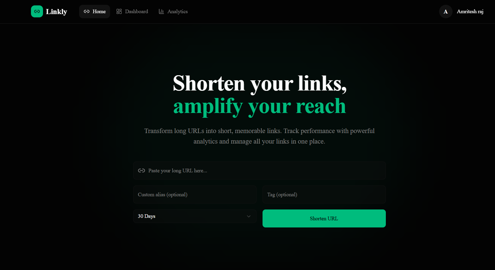
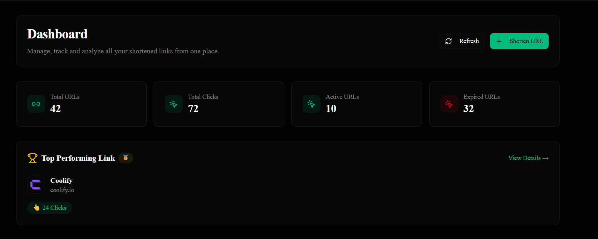
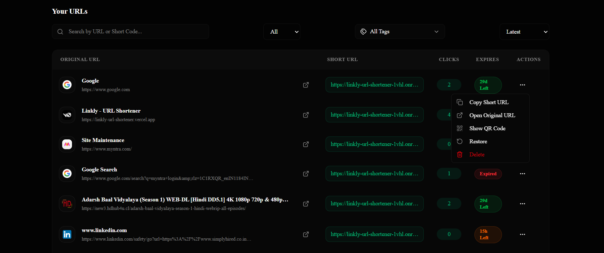
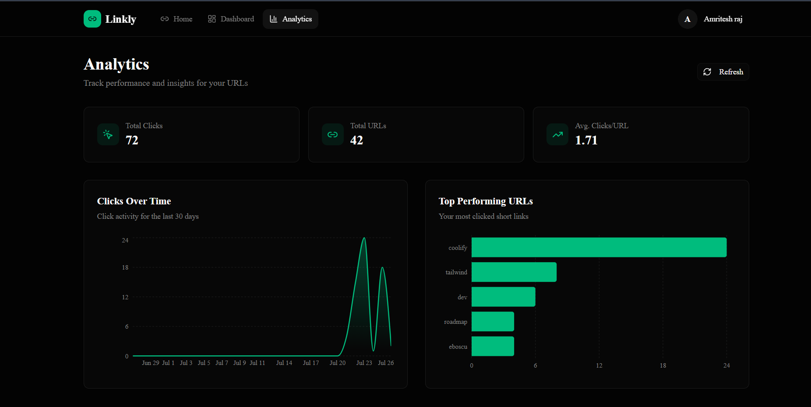

<div align="center">

# 🔗 Linkly – Modern URL Shortener


Production-ready Full Stack URL Shortener built with **Next.js**, **Node.js**, **Express.js**, and **MongoDB Atlas**.

Create short links, track analytics, generate QR codes, and manage URLs from a modern dashboard.

### 🌐 Live Demo

**Frontend:** https://linkly-url-shortener.vercel.app

**Backend:** https://linkly-url-shortener-1vhl.onrender.com

</div>

---

# 📸 Project Preview

## Home



---

## Dashboard



---

## URL Management



---

## Analytics



---

# ✨ Features

### Authentication

- JWT Authentication
- Secure Signup/Login
- Protected Routes
- Logout

### URL Management

- Create Short URLs
- Custom Alias
- Expiry Support
- Permanent Links
- Delete URLs
- Restore Deleted URLs
- Search & Filter
- Tag Support

### Analytics

- Total URLs
- Total Clicks
- Active URLs
- Expired URLs
- Most Clicked URL
- Click History
- Clicks Over Time

### Additional Features

- QR Code Generation
- Automatic Website Title
- Automatic Favicon Detection
- Open Graph Metadata
- URL Validation

---

# 🔒 Security

- Helmet
- Rate Limiter
- MongoDB Sanitization
- XSS Protection
- HPP
- Compression
- JWT Authentication

---

# 🛠 Tech Stack

## Frontend

- Next.js 16
- TypeScript
- Tailwind CSS
- shadcn/ui
- Lucide React

## Backend

- Node.js
- Express.js 5
- MongoDB Atlas
- Mongoose
- JWT
- Open Graph Scraper

## Deployment

- Vercel
- Render
- MongoDB Atlas

---

# 📂 Folder Structure

```text
Linkly
│
├── frontend
│
│── app
│── components
│── services
│── hooks
│── context
│
└── backend
│── controller
│── middleware
│── model
│── routes
│── utils
│── server.js
```

---

# 🚀 Installation

Clone Repository

```bash
git clone https://github.com/Amritesh123-jpg/linkly-url-shortener.git
```

Backend

```bash
cd backend
npm install
npm start
```

Frontend

```bash
cd frontend
npm install
npm run dev
```

---

# ⚙ Environment Variables

Backend

```env
DATABASE=
DATABASE_PASSWORD=
JWT_SECRET=
JWT_EXPIRES_IN=
PORT=
```

Frontend

```env
NEXT_PUBLIC_API_URL=
```

---

# 📡 API Routes

Authentication

```http
POST /auth/signup
POST /auth/login
```

URL

```http
POST /url/shorten
GET /url/dashboard
DELETE /url/:id
PATCH /url/restore/:id
GET /:shortCode
```

---

# 🏗 Architecture

```text
                User
                  │
                  ▼
      Next.js Frontend (Vercel)
                  │
            REST API
                  │
                  ▼
      Express.js Backend (Render)
                  │
                  ▼
          MongoDB Atlas Database
```

---

# 📈 Highlights

- Full Stack Application
- Production Deployment
- Mobile Responsive
- Secure Authentication
- Analytics Dashboard
- Clean UI
- REST API
- JWT Security
- URL Analytics
- QR Code Support

---

# 🔮 Future Improvements

- Redis Cache
- Docker
- Custom Domain
- Team Collaboration
- Email Verification
- CI/CD
- Unit Testing

---

# 👨‍💻 Author

**Amritesh Raj**

GitHub

https://github.com/Amritesh123-jpg

---

## ⭐ If you found this project useful, consider giving it a star!
