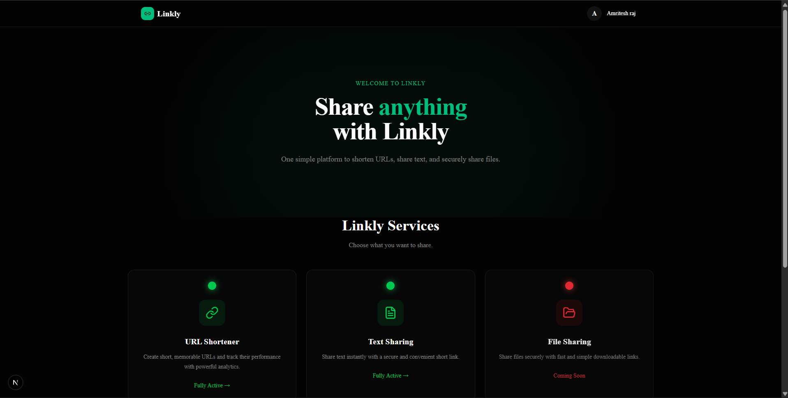
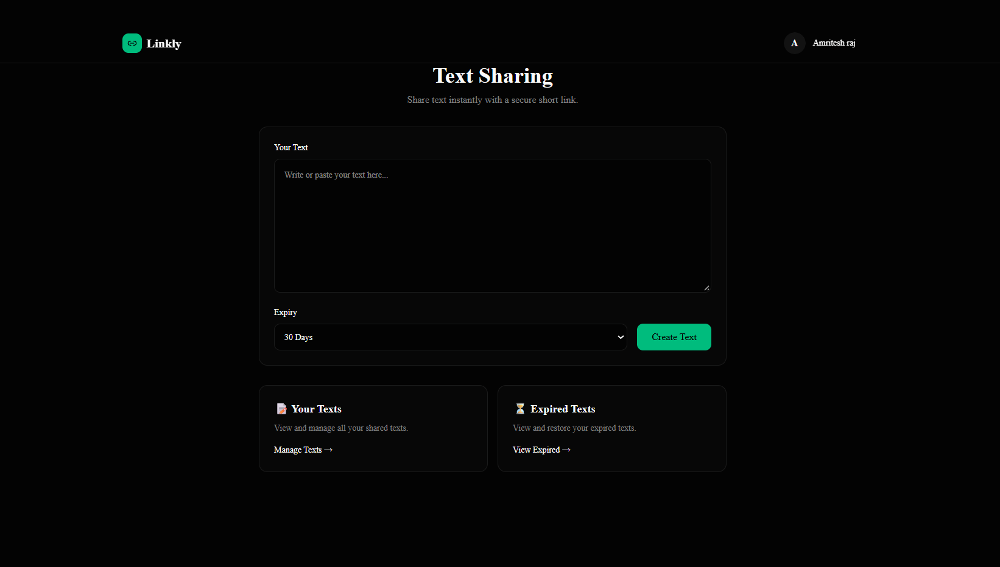

<div align="center">

# 🔗 Linkly – Modern URL & Text Sharing Platform


A modern full-stack platform for **shortening URLs and sharing text**,
built with **Next.js, TypeScript, Node.js, Express.js, MongoDB, and Redis**.

Create short links, manage URLs, track analytics, generate QR codes,
share text through public links, and manage everything from a modern dashboard.

### 🌐 Live Demo

**Frontend:**  
https://linkly-url-shortener.vercel.app

**Backend:**  
https://linkly-url-shortener-1vhl.onrender.com

</div>

---

# 📖 About Linkly

Linkly is a full-stack sharing platform that brings multiple sharing
features together in one place.

Currently, Linkly provides:

- 🔗 **URL Shortener**
- 📝 **Text Sharing**

The platform includes secure authentication, URL management,
expiry handling, analytics, QR code generation, public text sharing,
and protected user dashboards.

📁 **File Sharing** is planned as a future feature.

---

# 📸 Project Preview

## 🏠 Landing Page



---

## 🔗 URL Shortener


---

## 📝 Text Sharing



---

## 📊 Dashboard


---

## 🔗 URL Management


---

## 📈 Analytics


---

# ✨ Features

## 🔐 Authentication

- JWT Authentication
- Access Token + Refresh Token
- Secure Signup/Login
- Protected Routes
- HttpOnly Refresh Token Cookie
- Refresh Token Storage using Redis
- Automatic Access Token Refresh
- Concurrent Refresh Request Handling
- Logout
- Role-based Authorization
- Password Update

---

# 🔗 URL Shortener

Linkly provides a complete URL shortening and management system.

### URL Creation

- Create Short URLs
- Custom Alias
- Expiry Support
- Permanent Links
- URL Validation
- Automatic Website Title Detection
- Automatic Favicon Detection
- Open Graph Metadata

### URL Management

- Search URLs
- Sort URLs
- Filter Active URLs
- Filter Expired URLs
- Tag Support
- Pagination
- Click Tracking
- Expiry Status
- Restore Expired URLs
- QR Code Generation

### URL Restoration

Expired URLs can be restored with a new expiry duration.

Available restoration options:

- 1 Day
- 7 Days
- 30 Days
- Never Expire

---

# 📝 Text Sharing

Linkly also provides a simple text-sharing system using short public links.

### Text Creation

- Create and share text
- Expiry support
- Permanent text sharing
- Generate short public links
- Copy generated links
- Share generated links
- Open shared text

### Text Management

- View active texts
- View expired texts
- Pagination
- Restore expired texts
- Delete texts
- Copy text
- Share text links

### Text Restoration

Expired texts can be restored with a new expiry duration.

Available options:

- 5 Minutes
- 10 Minutes
- 30 Minutes
- 1 Hour
- 1 Day
- 7 Days
- 30 Days
- Never Expire

### Public Text Sharing

Creating text requires authentication, but viewing a shared text
does not require the viewer to log in.

```text
Logged-in User
      │
      ▼
 Create Text
      │
      ▼
 Generate Short Link
      │
      ▼
 Share Link
      │
      ▼
 ┌───────────────────────┐
 │ Anyone with the link  │
 │ can view the text     │
 └───────────────────────┘